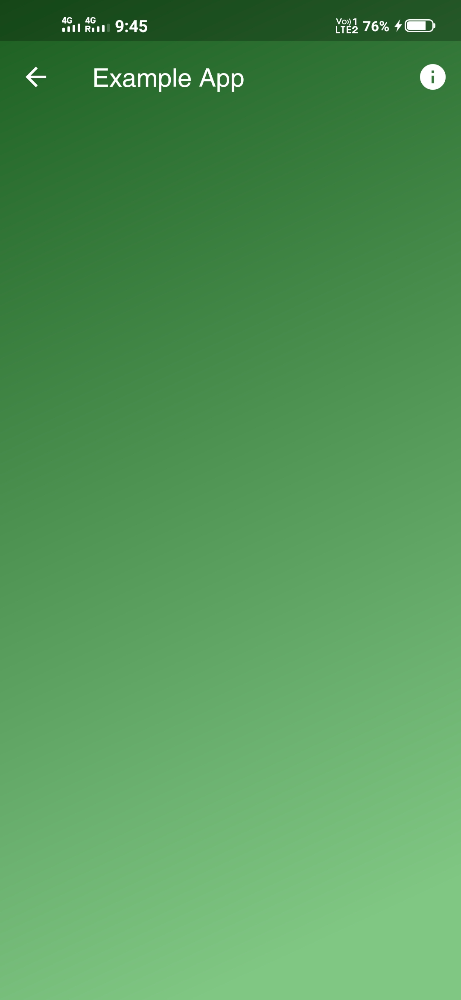

# gradient_scaffold

A new Flutter package which creates a gradient scaffold.

## Getting Started

This project is a starting point for a Dart
[package](https://flutter.dev/developing-packages/),
a library module containing code that can be shared easily across
multiple Flutter or Dart projects.

For help getting started with Flutter, view our 
[online documentation](https://flutter.dev/docs), which offers tutorials, 
samples, guidance on mobile development, and a full API reference.
# gradient-scaffold-package

## Screenshots

<p float="left">
    
    
    
</p>

## How to use it in your project?
### Add Dependency
Add this to your package's pubspec.yaml file:

```yaml
dependencies:
  gradient_scaffold: ^0.0.1
 ```
 
 ### Install it
You can install packages from the command line:
    
    $ flutter pub get

Alternatively, your editor might support flutter pub get. Check the docs for your editor to learn more.

### Import it
Now in your Dart code, you can use:

```dart
import 'package:gradient_scaffold/gradient_scaffold.dart';
```
### Demo Code
```dart
import 'package:flutter/material.dart';
import 'package:gradient_scaffold/gradient_scaffold.dart';

class ExampleApp extends StatefulWidget {
  @override
  _ExampleAppState createState() => _ExampleAppState();
}

class _ExampleAppState extends State<ExampleApp> {
  @override
  Widget build(BuildContext context) {
    return GradientScaffold(
      gradientBegin: Alignment.topLeft,
      gradientEnd: Alignment.bottomRight,
      gradientColors: [
        Color(0xFF159DFF),
        Color(0xFF157DDF)
      ], //list of colors you want to use
      gradientStops: [0.0, 0.5], //list of stops you want to use
      appBarTitle: "Example App", //title that appears on your appBar
      appBarElevation: 0.0,
      appBarActions: <Widget>[
        Padding(
          padding: const EdgeInsets.only(right: 10.0),
          child: Icon(Icons.info),
        )
      ],
      body: Container(
        width: 100.0,
        height: 100.0,
        color: Colors.white,
      ), // this is the scaffold body
    );
  }
}
```
